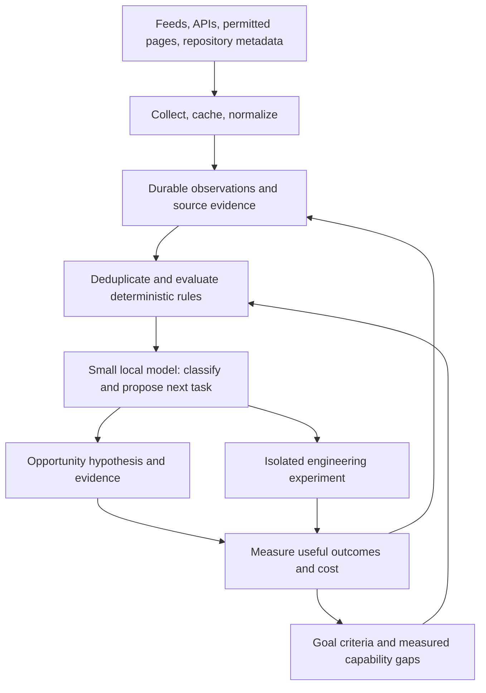

# Oct8pia: opportunity discovery and measured self-improvement

Current scope and implementation sequence: [ADVANTAGE_ENGINE.md](ADVANTAGE_ENGINE.md). ROOT is an engine for discovering, testing and operating multiple micro-businesses; this earlier architecture is supporting design material.

Status: proposed architecture, 2026-09-15. No services or autonomous jobs have been installed.

Execution order superseded by [DELIVERY_PLAN.md](DELIVERY_PLAN.md): validate a customer deliverable and paid pilot before model benchmarking or repository self-improvement. The architecture below remains a possible later design.

Use Oct8pia as the working project name. Retain R∞T as the original blueprint codename until Richard settles the naming. This document extends the supplied spatial intelligence blueprint into a general evidence and opportunity system.

## Purpose

Build a system that helps create family income while remaining manageable during Richard's recovery. Its useful output is evidence someone can act on, with source provenance and measured costs. Revenue and predictive lead times are hypotheses to validate; the blueprint's price ranges and 72-hour forecast claims are not established results.

The same collector can observe external opportunities and internal capability gaps. Improving extraction reliability can improve opportunity coverage; evidence from opportunity work can reveal which engineering improvements matter.

## Shared pipeline

GeoJSON is an optional view of observations that have coordinates. Repository releases, customer needs and extraction failures must remain usable without invented locations.

An observation records source URL, source identity, fetch time, publication time where available, content hash, raw evidence reference, normalized fields, extraction version and applicable usage constraints. A task records its triggering observations, related goal, acceptance criteria, budget, attempts and result.

## Two uses of the same evidence

Opportunity discovery follows a concrete customer need: collect changes, compare them against a baseline, produce a sourced hypothesis and evaluate whether it was useful. Start with one source family and one potential buyer type. Candidate examples include public procurement changes or permit alerts; no niche has yet been selected or validated.

Capability discovery starts with a measured gap: repeated parser failures, an unmet goal criterion, excessive browser time or duplicate alerts. Search repository metadata, documentation and releases for that specific gap. Trending repositories can seed discovery, but popularity does not establish suitability.

For example, a collector's extraction success rate falls below its configured baseline. The system opens a capability task, examines candidate parser approaches and tests one against saved pages. Adopt it only if field accuracy and coverage improve within the runtime and bandwidth budget. Replaying the same pages makes the comparison meaningful.

## Heartbeat and goals

The heartbeat is a scheduler that selects due work. It does not call a model simply because a timer fired.

1. Check overdue collectors, source backoff, pending goals and observed failures.
2. Select a bounded task using deterministic priority rules and available budgets.
3. Fetch through the cheapest suitable transport and retain replayable evidence.
4. Skip duplicates; evaluate configured change and relevance gates.
5. Ask the local model only when classification or task choice needs it.
6. Validate its structured proposal against the executor's tool policy.
7. Execute the permitted task, record its outcome and schedule the next attempt.

A goal needs an observable completion criterion, a deadline where appropriate and resource limits. Example: "Produce a daily digest of new notices from these two public sources, with links, no duplicate notices and a measured delivery success rate." A model's assertion that the goal is done does not satisfy those criteria.

Suggested task states: queued, running, completed, failed and waiting for input. Persist task claims and attempt records so restart recovery can distinguish unfinished work from completed actions. Prevent overlapping heartbeat runs and repeated delivery with stable task and delivery identifiers.

## Small-model role

A model below six billion parameters is a candidate for narrow classification, field mapping and selecting from a small tool menu. Reliability must be established on recorded tasks, including ambiguous pages and tool failures. Parameter count alone does not establish fitness or memory requirements.

An orchestrator connects the model to the MCP client, validates tool calls and executes them. Installing Playwright MCP alone does not make a local model an autonomous agent.

Prefer feed/API/HTTP extraction for routine collection. Use a browser when interaction or rendering is required. Playwright MCP supports structured accessibility snapshots, so browser tasks need not require a vision model. Bound the number of steps, response size, browser concurrency and inference time; escalate unresolved tasks to stronger reasoning or leave them pending with evidence.

On this machine's slow connection, cache responses, use conditional requests when supported, back off by source and fetch repository metadata before downloading code. Keep source evidence even when presenting concise model inputs.

## Engineering experiments

Each candidate records the exact upstream revision, relevant files, license, dependencies, proposed benefit and baseline evaluation. Prefer consuming a maintained package through an adapter where that meets the need. Copied code also needs provenance and preserved applicable notices.

Run experiments separately from the deployed collector. Repository content and page text are evidence, never authority to change the executor's permissions. Evaluation requires field accuracy, coverage, runtime, resource cost and failure behavior; a patch merely running without exceptions is insufficient.

Initial autonomy can cover collection, classification, local reports and preparation of experiments. A later deployment policy can allow promotion of bounded changes after independent checks, with a versioned release and rollback path. Set the policy explicitly before enabling deployment, spending, trading or external outreach.

## Minimal implementation sequence

1. One durable local observation/task store, one configurable collector, replay fixtures and a source-linked digest. SQLite is a candidate for operational state; add DuckDB for analytical queries when needed.
2. Deterministic change gates, resumable heartbeat execution, budgets and a simple status view.
3. Benchmark a small local model on classification and bounded tool tasks before routing production tasks to it.
4. Add repository discovery driven by actual capability gaps and one replayable improvement experiment.
5. Validate demand for a specific information product and record operating cost, usefulness and actual revenue.
6. Add spatial storage, streaming or a globe when the selected use case needs them.

The first demonstration should complete the feedback loop: capture a real signal, produce a useful sourced output, identify a real extraction weakness, test an improvement and quantify its effect.

## Corrections to the supplied blueprint

- Its snippets are illustrative rather than a runnable application: the parser/ingestion integration is incomplete, publishing is undefined and the WebSocket handler does not broadcast data.
- In-memory storage loses observations on restart. Durable operational state is necessary for a heartbeat.
- Zero latitude or longitude is valid. Validate missing coordinates and numeric ranges instead of rejecting either axis at zero.
- Repeated anomaly checks need event identity and cooldown rules to avoid repeated model calls and alerts.
- "Low entropy" is useful shorthand here for reducing irrelevant material. It is not a measured opportunity score. Track novelty, relevance, evidence quality, actionability and cost separately; repetitive misinformation can also be highly predictable.
- The current WorldWideView README describes CesiumJS and Elastic License 2.0, whereas the blueprint assumes a MapLibre/Deck.gl fork. Inspect the actual revision and license before choosing it as a commercial foundation.

## Primary references checked

- [Scrapling](https://github.com/D4Vinci/Scrapling): HTTP and browser collection, adaptive parsing, captured XHR responses, caching and crawl features. Validate exact APIs against a pinned version during implementation.
- [Playwright MCP](https://github.com/microsoft/playwright-mcp): structured accessibility snapshots and browser tools. Its documentation explicitly says it is not a security boundary; isolation belongs in the execution environment.
- [WorldWideView](https://github.com/silvertakana/worldwideview): current CesiumJS architecture and stated Elastic License 2.0.
- [RADAR](https://github.com/Syntax-Error-1337/radar): geospatial dashboard and stated MIT license. This is discovery-level review, not a code or dependency audit.
